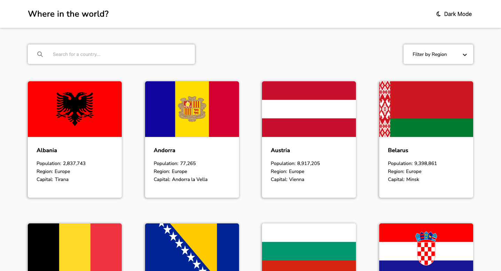
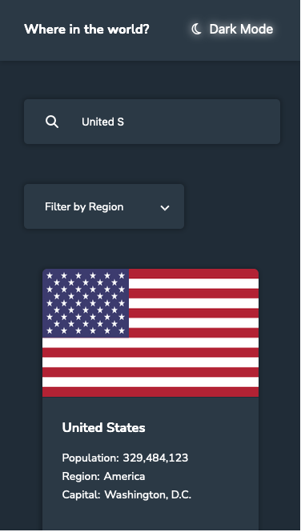

# Frontend Mentor - REST Countries API with color theme switcher solution

This is a solution to the [REST Countries API with color theme switcher challenge on Frontend Mentor.](https://www.frontendmentor.io/challenges/rest-countries-api-with-color-theme-switcher-5cacc469fec04111f7b848ca) This solution is based on my first project with HTML, CSS and Javascript and it is build with REACT.

## Table of contents

- [Overview](#overview)
  - [The challenge](#the-challenge)
  - [Screenshot](#screenshot)
  - [Links](#links)
- [My process](#my-process)
  - [Built with](#built-with)
  - [What I learned](#what-i-learned)
  - [Continued development](#continued-development)
  - [Useful resources](#useful-resources)
- [Author](#author)
- [Acknowledgments](#acknowledgments)

## Overview

### The challenge

Users should be able to:

- See all countries from the API on the homepage
- Search for a country using an `input` field
- Filter countries by region
- Click on a country to see more detailed information on a separate page
- Click through to the border countries on the detail page
- Toggle the color scheme between light and dark mode _(optional)_

### Screenshot

### Links

- Solution URL: [GitHub](https://github.com/sandigesandburg/REST-Country-API_React)
- Live Site URL: [GitHub Pages](https://sandigesandburg.github.io/REST-Countries-API/public/index.html)

## My process

### Built with

- Semantic HTML5 markup
- CSS custom properties
- Flexbox
- CSS Grid
- Javacript
- React

### What I learned

- React
- React-Routing
- CSS modules

### Continued development

- use of TypeScript
- automatic testing
- rearranging of items of different widths to fit space properly (Tabs for Border Countries)
- extend hover and state Animations
- properly async fetch handling

### Useful resources

- [Original REST Country Project](https://restcountries.com/)

## Author

- Frontend Mentor - [sandigesandburg](https://www.frontendmentor.io/profile/sandigesandburg)

## Acknowledgments

Special Thanks to the YouTube Cummunity and Stack Overflow. =)
